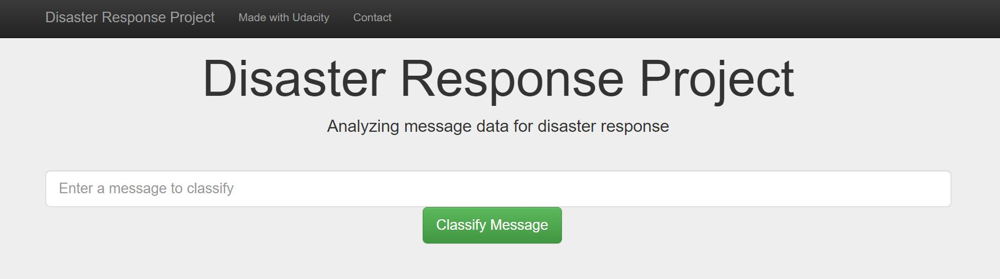
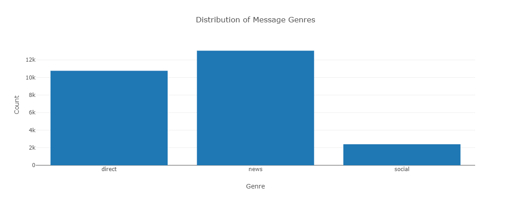
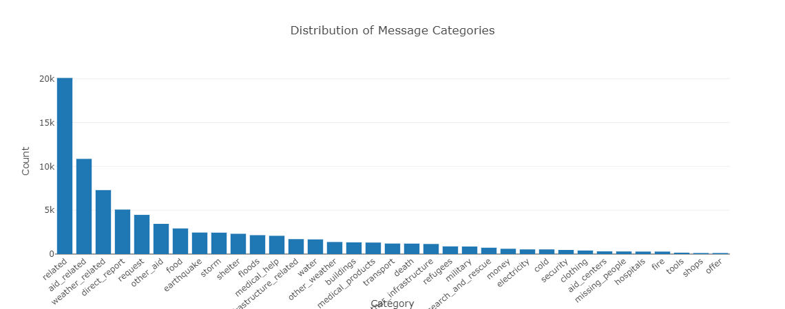
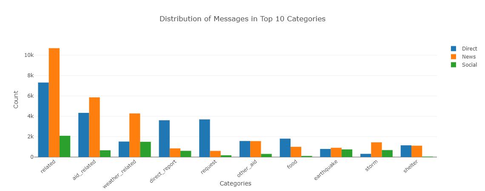
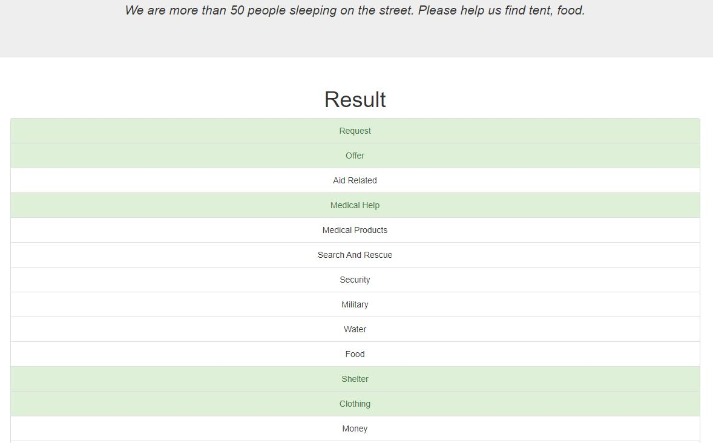
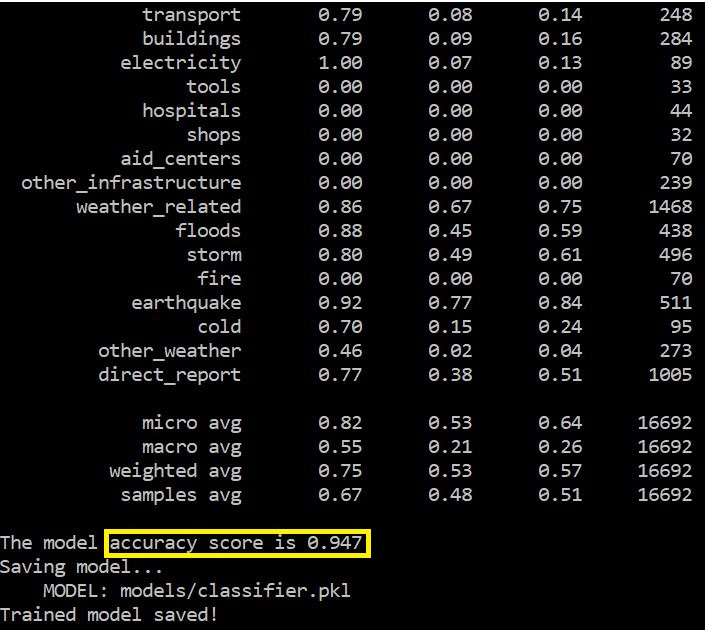
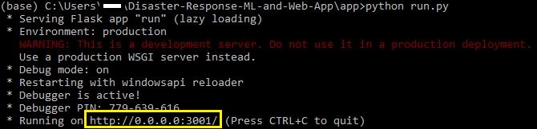

# Disaster Response Pipeline and Web App
- [Project Overview](#Project-Overview)
- [Installation](#Installation)
- [Project Components](#Components)
- [File Descriptions](#File-Descriptions)
- [Instructions](#How-To-Run-This-Project)
- [Discussion](#Discussion)
- [Licensing, Authors, Acknowledgements](#License)

## Project Overview <a name="Project-Overview"></a>
The Disaster Response Pipeline project is part of the Udacity Data Science Nano Degree in collaboration with Figure Eight. This project builds a Natural Language Processing (NLP) pipeline classifying disaster messages into several categories. The project also provides a web application that lets an emergency worker, in case of disaster events, inputs new messages, get classification results, then send the messages to appropriate disaster relief agencies.  

**Background:** Figure Eight provided a pre-labeled dataset containing tweets and messages sent in real-life disaster events. These real messages are labeled with categories such as water, food, medical help, shelter, and so on. Following a disaster, there are millions of messages received either directly or via social media. Often time the disaster response organizations have the least capacity to filter the messages when a disaster is happening. Therefore, supervised machine learning models categorizing the messages based on keywords with high accuracy is desirable in order to investigate new trends and help Figure Eight respond to future disaster messages.


**The goal** of this project is to build an NLP pipeline that processes the text data and performs multi-output classification on 36 categories. GridSearchCV is also implemented to tune the best parameters for the model. Finally, a web app built from Flask will display some visualization about data, take in new messages and classify their categories. Details on the dataset and machine learning model choice are discussed below.

## Installation <a name="Installation"></a>
The following packages and versions are used in this jupyter notebook. Any recent versions should work.
| Package  | Version |
| ------------- | ------------- |
| Python  | 3.8.5  |
| Pandas  | 1.1.3  |
| Numpy   | 1.19.2 |
| Matplotlib | 3.3.2|
| sqlalchemy | 2.5.1|
| nltk    | 3.6.2|
| scikit-learn  | 0.24.2|
| pickle  | 1.6.0|
| Flask   | 1.1.2|
| json    | 0.9.6|
| plotly  | 4.4.13|
| joblib  | 1.0.1|

## Project Components <a name="Components"></a>
There are 3 main components in this project.
### 1. ETL pipeline
- Load two datasets
- Merge the sets and clean the data
- Store the data in a SQLite database

### 2. ML pipeline
- Load the clean data from the SQLite database
- Split the data to train-test sets
- Build a text processing and machine learning model with NLTK
- Train and tune the model with GridSearchCV
- Evaluate the model
- Export the final model as a pickle file

### 3. Flask Web App
A web application displays some visualization about the dataset. Users can type in any new messages in the web app and receive the categories that the message may belong to.


Figure 1. Input field takes in new messages.


Figure 2. The distribution of message genres provided by the dataset.


Figure 3. Pre-labelled messages categories.


Figure 4. Distribution of messages by genres in top 10 categories.


Figure 5. An example message _"We are more than 50 people sleeping on the street. Please help us find' tent, food."_ is classified in the following categories: request, offer, medical help, shelter, clothing.

## File Description <a name="File-Descriptions"></a>
This is the high level description of all the files in this project.
```
├── app
│   ├── run.py--------------------------------# Flask file runs the web app
│   └── templates
│       ├── go.html---------------------------# Result page
│       └── master.html-----------------------# Main page
├── data
│   ├── DisasterResponse.db-------------------# *Database storing the processed data
│   ├── disaster_categories.csv---------------# Pre-labelled dataset
│   ├── disaster_messages.csv-----------------# Data
│   ├── process_data.py-----------------------# ETL pipeline processing the data
|   └── ETL Pipeline Preparation_NP.ipynb-----# Jupyter notebook with details
├── img---------------------------------------# Visualizations captured from the web app
├── models
|   ├── train_classifier.py-------------------# Machine learning pipeline
│   ├── ML Pipeline Preparation_NP.ipynb------# Jupyter notebook with details
|   └── classifier.pkl------------------------# *Pickle file

*Files that will be generated when the python scripts .py are executed.
```

The original datasets are provided in `.csv` files <br>
2 jupyter notebooks `.ipynb` detail the data cleaning and machine learning processes. <br>
A README.md file describes this repository.

## Instructions <a name="How-To-Run-This-Project"></a>
### 1. Download the files or clone this repository
  ```
  git clone https://github.com/Az-otrope/Disaster-Response-ML-and-Web-App
  ```
### 2. Execute the scripts
a. Open a terminal <br>
b. Direct to the project's root directory <br>
c. Run the following commands: <br>
- To run ETL pipeline that cleans data and stores in database
  ```
  python data/process_data.py data/disaster_messages.csv data/disaster_categories.csv data/DisasterResponse.db
  ```
- To run ML pipeline that trains classifier and saves
  ```
  python models/train_classifier.py data/DisasterResponse.db models/classifier.pkl
  ```

d. Go to the app's directory and run the command
```sh
cd app
python run.py
```


e. The web app instantiates. Type http://0.0.0.0:3001/ or http://localhost:3001/ to launch the webpage on the web browser.



f. Input any message in the input box and click on the Classify Message button to see the categories that the message may belong to.

## Discussion <a name="Discussion"></a>
### 1. Dataset distribution
According to figures 3 and 4, this dataset is highly imbalanced. We can see that most messages are classified in the top 10 categories: related, aid-related, weather-related, request, and so on. Given this pre-labeled dataset, most newly entered disaster messages will be classified as _related_ which doesn't give much useful information.

In some cases, the message contains words that don't directly point to any particular category but its implication is still important. For instance, a message saying _"The water pipes break and my house floor is covered in water"_. The model catches the key words and classifies this message into _water, aid help_ categories, but instead the _flood, building, infrastructure_ maybe more accurate. This signals that the context is an important factor to properly label messages' categories.

### 2. ML model choice
One of the goals of this project is to implement the use of GridSearchCV to tune and find the best parameters for the model. However, the final model chosen for this project is a Random Forest Classification without tuned parameters, since it produces the highest accuracy.

The jupyter notebook `ML Pipeline Preparation_NP` entails two other classification models, KNN and Decision Tree. Three algorithms are tested with and without GridSearchCV. They are then scored against each other based on the accuracy scores. All models performed better without GirdSearch implementation. This could be due to the highly imbalanced data and poor labels.

### 3. Suggestions
The following suggestions can improve the model:
a. f1-score is better as a comparison metric for imbalanced dataset
b. Take the context of the message into account to improve the labelling process for training data.


## Licensing, Authors, Acknowledgements <a name="License"></a>
* [Figure Eight](https://www.figure-eight.com/) for providing the datasets and directions
* [Udacity](https://www.udacity.com/) for project goal
* Author: [Nguyen Pham](https://github.com/Az-otrope)
